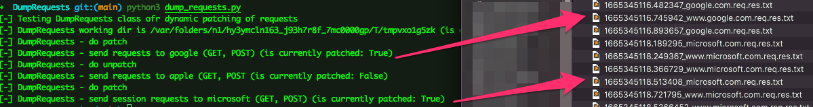
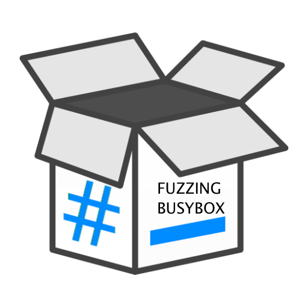
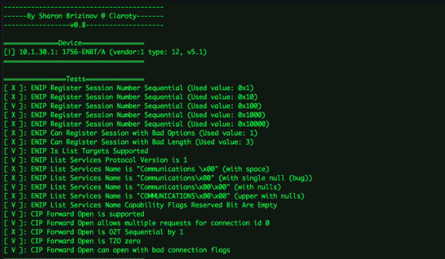

## About Me

Hello! I'm Sharon Brizinov, a security researcher. I specialize in vulnerability research and ICS/SCADA security. Most of the vulnerabilities I have found can be found [here](https://sharonbrizinov.com/cves). I've present my research in various security conferences including DEFCON, HITCON, BlueHat, SANS, S4, HackInParis, and others. I also participated in Pwn2Own [2020](https://www.zerodayinitiative.com/blog/2020/1/21/pwn2own-miami-2020-schedule-and-live-results), [2022](https://www.zerodayinitiative.com/blog/2022/4/14/pwn2own-miami-2022-results) and won DEFCON 27's ICS CTF, earning a [DEFCON black badge](https://www.defcon.org/html/links/dc-black-badge.html).

Besides security research, I also like to develop mobile applications and games. You can find most of my projects on [GitHub](https://github.com/sharonbrizinov). 

## Writeups, competitions, and presentations

* 2019 - [Competition]  [S4x19 - ICS CTF](https://s4xevents.com/past-events-2/s4x19/)
* 2019 - [Competition]  [DEFCON 27 - ICS CTF](https://www.defcon.org/html/links/dc-black-badge.html)
* 2019 - [Presentation] [DEFCON 27 - Magical Change-IP Packets In the Wild](https://www.youtube.com/watch?v=lggrDCYsVpw&ab_channel=DEFCONConference)
* 2020 - [Competition]  [Pwn2Own 2020 - ICS Miami](https://www.zerodayinitiative.com/blog/2020/1/21/pwn2own-miami-2020-schedule-and-live-results)
* 2020 - [Research Paper]  [Exploiting WIBU CodeMeter to attack ICS networks](https://www.claroty.com/2020/09/08/blog-research-wibu-codemeter-vulnerabilities/)
* 2020 - [Writeup]      [ZDI - RCE on Schneider Electric Ecostruxure software](https://www.thezdi.com/blog/2020/9/9/performing-sql-backflips-to-achieve-code-execution-on-schneider-electrics-ecostruxure-operator-terminal-expert-at-pwn2own-miami-2020)
* 2020 - [Research Paper]  [Exploring The OPC Attack Surface](https://www.claroty.com/wp-content/uploads/2021/02/FINAL_Claroty_OPC_Research_Paper.pdf)
* 2021 - [Presentation] [Hack the Capitol - Attacking Your OT Network](https://www.youtube.com/watch?v=ZtMO-F7zraI)
* 2021 - [Presentation] [DEFCON 29 - Exploiting Vulnerabilities In the OT Cloud Era](https://www.youtube.com/watch?v=l3rs1GwOVSU)
* 2021 - [Writeup]      [Finding Bugs in a Popular EtherNet/IP Protocol Stack](https://claroty.com/2021/04/15/blog-research-fuzzing-and-pring/)
* 2021 - [Writeup]      [Crashing SIP Clients With a Single Slash](https://claroty.com/2021/08/31/blog-research-crashing-sip-clients-with-a-single-slash)
* 2021 - [Writeup]      [Unboxing BusyBox: 14 Vulnerabilities Uncovered](https://claroty.com/2021/11/09/blog-research-unboxing-busybox-14-vulnerabilities-uncovered-by-claroty-jfrog/)
* 2021 - [Writeup]      [Pwning Industrial Remote Access Clients](https://claroty.com/2021/11/19/blog-research-all-roads-lead-to-openvpn-pwning-industrial-remote-access-clients/)
* 2021 - [Presentation] [HackInParis 2021 - Pwning Industrial Remote Access Clients](https://www.youtube.com/watch?v=rNHshToPt2Y&ab_channel=HackinParis)
* 2022 - [Research Paper]  [Exploiting URL Parsers](https://claroty.com/wp-content/uploads/2022/01/Exploiting-URL-Parsing-Confusion.pdf)
* 2022 - [Writeup] 		[Hiding Code on Rockwell Automation PLCs](https://claroty.com/2022/03/31/blog-research-hiding-code-on-rockwell-automation-plcs/)
* 2022 - [Presentation] [BlueHat IL 2022 - Pwn'ing Cloud-Based Intercoms at Scale](https://www.youtube.com/watch?v=YTxABU_L2Ok)
* 2022 - [Presentation] [S4x22 2022 - The Race to Native Code Execution in Siemens PLCs](https://www.youtube.com/watch?v=r-dmxU1gEl0)
* 2022 - [Presentation] [SANS ICS 2022 - Hunting EtherNet/IP Protocol Stacks](https://www.youtube.com/watch?v=0jftEYDo0ao)
* 2022 - [Research Paper] [Evil PLC Attack: Weapnizing PLCs](https://claroty-statamic-assets.nyc3.digitaloceanspaces.com/resource-downloads/team82-evil-plc-attack-research-paper.pdf)
* 2022 - [Presentation] [DEFCON 30 - Evil PLC Attack](https://www.youtube.com/watch?v=pNNOUiR8EQo)

---

## Projects

Type | Name  | Description
------|------|--------
Misc | [Slack Anti-Delete](https://github.com/SharonBrizinov/slack-anti-delete) [Slack Sounds](https://github.com/SharonBrizinov/slack-sounds)|  Some research I did on Slack - I patched my Slack client to keep messages that others delete, simple tool to customize Slack sound notifications.
Dev | [DumpRequests](https://github.com/SharonBrizinov/DumpRequests) |  Simple stupid class for globaly auto patching the entire python requests library to dump all requests and responses, for debug purposes.
Security | [Unboxing Busybox - BusyBox Fuzzing](https://github.com/claroty/busybox-fuzzing) |  Created a detailed guides & tools to fuzz the popular BusyBox software suite (several Unix utilities in a single executable file).
Security | [EtherNet/IP & CIP Stack Detector](https://github.com/claroty/enip-stack-detector) |  EtherNet/IP & CIP Stack Detector that can help both cyber-security researchers, OT engineers, and asset owners to identify devices that are running a specific EtherNet/IP protocol stack.
Security | [s3viewer](https://github.com/SharonBrizinov/s3viewer) |  Free tool for security researchers that lists the content of publicly open storages and helps to identify leaking data.
Security | [Windows Keylogger](https://github.com/SharonBrizinov/SimpleKeylogger) |  Simple Windows keylogger using Windows Hooks. Also supports foreign languages
Game | [#Yo](http://www.hashtagyo.com/) |  #Yo is a fun mobile app game and a super-challenging way to enjoy the good old and crazy-fun Simon Says game.
Game | [Assembly iCopter](https://github.com/SharonBrizinov/iCopter) |  The old iCopter game written in assembly.
Misc | [Whatsapp Analyzer](https://github.com/SharonBrizinov/Whatsapp-Analyzer) |  Native iOS application for analyzing whatsapp conversations freely on your own iOS device. Written in Objective-C.
Misc | [Meme Generator](https://appadvice.com/game/app/meme-pro-meme-generator-soundpad/488702679) |  Meme generator - create memes from a ready library images with over dozens of different memes, or take photos from your camera or from your saved images.