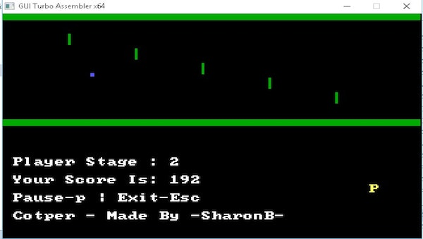
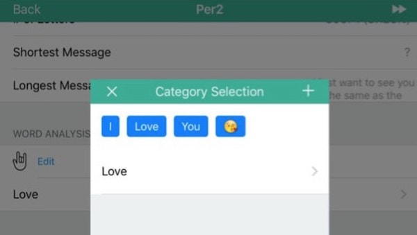
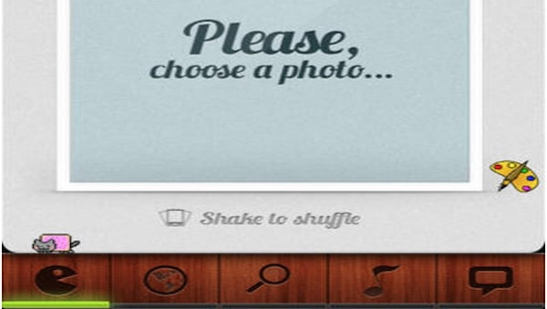

## About Me

Hi! My name is Sharon Brizinov and I’m a security researcher. I specialize with vulnerability research and ICS/SCADA security. You can check most of the vulnerabilities I have found [here](https://sharonbrizinov.com/cves).
In addition, I’m a practitioner of CTFs, took part of Pwn2Own 2020 and won the DEFCON 27’s ICS CTF and earned a [DEFCON black badge](https://www.defcon.org/html/links/dc-black-badge.html).

Besides security research, I also like to develop mobile applications and games. You can find most of my projects on [GitHub](https://github.com/sharonbrizinov). 

## Writeups, competitions, and presentations

* 2019 - [CTF] [S4x19 - ICS CTF](https://s4xevents.com/past-events-2/s4x19/)
* 2019 - [CTF] [DEFCON 27 - ICS CTF](https://www.defcon.org/html/links/dc-black-badge.html)
* 2019 - [Presentation] [DEFCON 27 - Magical change IP packets in the wild](https://www.youtube.com/watch?v=lggrDCYsVpw&ab_channel=DEFCONConference)
* 2020 - [CTF] [Pwn2Own 2020 - ICS Miami](https://www.zerodayinitiative.com/blog/2020/1/21/pwn2own-miami-2020-schedule-and-live-results)
* 2020 - [Writeup] [License to Kill: Leveraging license management to attack ICS networks](https://www.claroty.com/2020/09/08/blog-research-wibu-codemeter-vulnerabilities/)
* 2020 - [Writeup] [Performing SQL backflips to achieve code execution on Schneider Electric’s Ecostruxure software](https://www.thezdi.com/blog/2020/9/9/performing-sql-backflips-to-achieve-code-execution-on-schneider-electrics-ecostruxure-operator-terminal-expert-at-pwn2own-miami-2020)
* 2021 - [Presentation] [Hack the Capitol v4.0 - Attacking Your OT Network](https://www.youtube.com/watch?v=ZtMO-F7zraI&ab_channel=ICSVillage)

---

## Projects

Type | Name  | Description
------|------|--------
Security | [s3viewer](https://github.com/SharonBrizinov/s3viewer) |  Free tool for security researchers that lists the content of publicly open storages and helps to identify leaking data.
Security | [Windows Keylogger](https://github.com/SharonBrizinov/SimpleKeylogger) |  Simple Windows keylogger using Windows Hooks. Also supports foreign languages
Game | [#Yo](http://www.hashtagyo.com/) |  #Yo is a fun mobile app game and a super-challenging way to enjoy the good old and crazy-fun Simon Says game.
Game | [Assembly iCopter](https://github.com/SharonBrizinov/iCopter) |  The old iCopter game written in assembly.
Misc | [Whatsapp Analyzer](https://github.com/SharonBrizinov/Whatsapp-Analyzer) |  Native iOS application for analyzing whatsapp conversations freely on your own iOS device. Written in Objective-C.
Misc | [Meme Generator](https://appadvice.com/game/app/meme-pro-meme-generator-soundpad/488702679) |  Meme generator - create memes from a ready library images with over dozens of different memes, or take photos from your camera or from your saved images.